# llmclient

LLM client package for code analysis.

- **AgenticClient**: Provider-agnostic agentic client using [langchaingo](https://github.com/tmc/langchaingo). Gives the LLM tools to explore a repository and answer questions about code.

## AgenticClient

The agentic client runs a tool-calling loop where the LLM can explore code using read-only tools, then submits structured answers via `submit_answer`.

**Tools**: `list_directory`, `read_file`, `grep`, `git` (allowlisted subcommands), `submit_answer`

**Providers**: Google (Gemini), Anthropic (Claude), OpenAI

```mermaid
sequenceDiagram
    participant Caller
    participant AgenticClient
    participant LLM
    participant Tools

    Caller->>AgenticClient: CallLLM(prompt, repoPath, opts)
    AgenticClient->>LLM: system prompt + user prompt + tool definitions

    loop until submit_answer or 100 tool calls
        LLM-->>AgenticClient: tool call(s)
        alt submit_answer
            AgenticClient->>AgenticClient: collect answer
            AgenticClient-->>LLM: "Answer recorded"
        else read_file / list_directory / grep / git
            AgenticClient->>Tools: execute tool (sandboxed to repoPath)
            Tools-->>AgenticClient: result
            AgenticClient-->>LLM: tool result
        end
    end

    Note over LLM,AgenticClient: LLM sends message with no tool calls → done
    AgenticClient-->>Caller: []AnswerSchema
```

## Debug logging

Set `DEBUG=1` to write detailed logs to `/tmp/validator-agentic-<timestamp>.log`.
